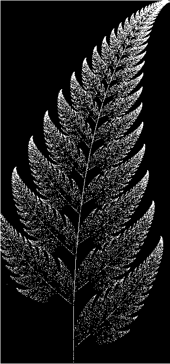
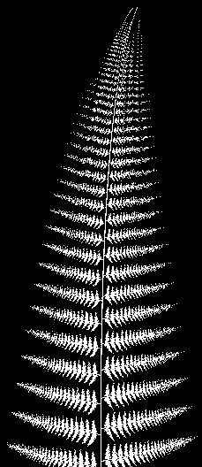

# barnsley fern

This is a c++ implementation of the Barnsley fern fractal.
It uses the SFML library.

The used coefficients can be easily changed in the program.

A result with the basic coefficients and 50000 iterations

Another result with some mutated coefficients found on the wikipedia page

